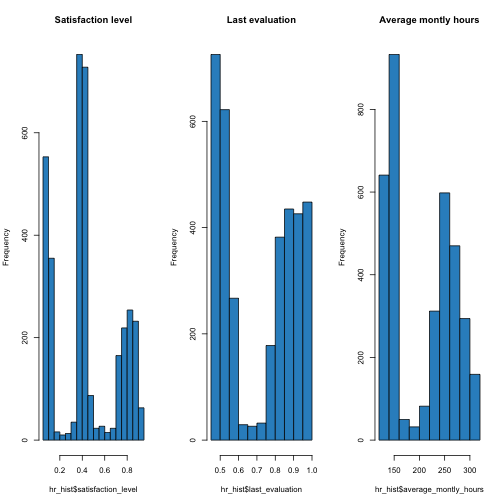

###Human Resources Analytics
##Why are our best and most experienced employees leaving prematurely?

<br>This is a dataset that includes 14999 observation of single employees
<br>Fields in the dataset include:

<br>Employee satisfaction level
<br>Last evaluation
<br>Number of projects
<br>Average monthly hours
<br>Time spent at the company
<br>Whether they have had a work accident
<br>Whether they have had a promotion in the last 5 years
<br>Department
<br>Salary
<br>Whether the employee has left

#The objectives of the project are the followings
<br>Which of those factors influence the employeers leaving?
<br>Who will leave next?

#The project is divided in the following step
<br>Step 1) Analyse actual state of the company HR indicators
- Clean the data
- Describe the data 
<br>Step 2) Analyse correlation and main factor definining HR indicators
-Correlationa analysis
-Factor reduction
<br>Step 3) Build a regression model to estimate who will be more likely to leave
-Simple regression model
-Randomtree model


##>Step 1)Analyse actual state of the company HR indicator

```r
myData <- read.csv(file = "DATA/HR_comma_sep.csv", header = TRUE, sep=",")
View(myData, header=TRUE)
colnames(myData)

print(myData[1:10])
```
Looking at data we can make the following assumptions related the nature of the 10 variables

<br>satisfaction_level: A numeric indictor, presumably filled out by the employee.
<br>last_evaluation: A numeric indicator, presumably filled in by the employee’s manager.
<br>number_project: A integer - perhaps the number of projects the employee has worked on. 
<br>average_monthly_hours: The number of hours they work in the month
time_spend_company: An integer value, perhaps years of service.
<br>Work_accident: Looks like a boolean value, probably whether(1) or not(0) they had an accident.
<br>left: Looks like a boolean value, leave (1), not leave(0)
promoted_last_5years: Looks like a boolean value, promoted(1), not promoted(0)
<br>sales: Is a categorical variable assessing the department (sales,technical...)
<br>salary: Looks like a 3-level salary score (low, medium, high)


```r
#We assess if there are any missing data and perform basic descriptive statistic on the data

summary(myData)
```

```
##  satisfaction_level last_evaluation  number_project  average_montly_hours
##  Min.   :0.0900     Min.   :0.3600   Min.   :2.000   Min.   : 96.0       
##  1st Qu.:0.4400     1st Qu.:0.5600   1st Qu.:3.000   1st Qu.:156.0       
##  Median :0.6400     Median :0.7200   Median :4.000   Median :200.0       
##  Mean   :0.6128     Mean   :0.7161   Mean   :3.803   Mean   :201.1       
##  3rd Qu.:0.8200     3rd Qu.:0.8700   3rd Qu.:5.000   3rd Qu.:245.0       
##  Max.   :1.0000     Max.   :1.0000   Max.   :7.000   Max.   :310.0       
##                                                                          
##  time_spend_company Work_accident         left       
##  Min.   : 2.000     Min.   :0.0000   Min.   :0.0000  
##  1st Qu.: 3.000     1st Qu.:0.0000   1st Qu.:0.0000  
##  Median : 3.000     Median :0.0000   Median :0.0000  
##  Mean   : 3.498     Mean   :0.1446   Mean   :0.2381  
##  3rd Qu.: 4.000     3rd Qu.:0.0000   3rd Qu.:0.0000  
##  Max.   :10.000     Max.   :1.0000   Max.   :1.0000  
##                                                      
##  promotion_last_5years         sales         salary    
##  Min.   :0.00000       sales      :4140   high  :1237  
##  1st Qu.:0.00000       technical  :2720   low   :7316  
##  Median :0.00000       support    :2229   medium:6446  
##  Mean   :0.02127       IT         :1227                
##  3rd Qu.:0.00000       product_mng: 902                
##  Max.   :1.00000       marketing  : 858                
##                        (Other)    :2923
```

<br>From basic statistical analysis we see that the overall satisfaction of the company is really low around 63% and that approximately 24% of the employees left. This brings us to the following step we would like therefore to understand bettwe who are the employees that are leaving

# Who is leaving

<br>We will start our analysis looking more deeply to a subset of employers that are leaving


```r
hr_hist <- filter(myData,left==1)
par(mfrow=c(1,3))
hist(hr_hist$satisfaction_level,col="#3090C7", main = "Satisfaction level") 
hist(hr_hist$last_evaluation,col="#3090C7", main = "Last evaluation")
hist(hr_hist$average_montly_hours,col="#3090C7", main = "Average montly hours")
```



<br>From the previous histograms we can colcude that not only employers with low satisfaction level and bad evaluation are leaving.

Looking at data it seems that none of the distribution is normal but show strong polarization:

1) Employers that are leaving are highly polirize in 2 categories(really bad or really good)
2) The distribution of employers that are leaving is quite polirize on employers that are medium on satisfaction.
3)Employers that work less seems more willing to leave


```r
par(mfrow=c(1,2))
hist(hr_hist$Work_accident,col="#3090C7", main = "Work accident")
plot(hr_hist$salary,col="#3090C7", main = "Salary")
```


<br>From a first analysis it  seems that the number of work accident and the salary are factors that might influence more directly the employers decision to leave


<br> ?????? Looking more deeply to relation between satisfaction level and decision to leaving:


```r
boxplot(myData[,1],myData[,7], main="Relation between satsfaction and left",xlab="left",ylab="satisfaction_level")
```


##Step 2) Analyse correlation and main factor definining HR indicators

To perform correlation we need first of all to normalize those data that are not metric and to drop the value that we want to predict (left) from the ananlysis


```r
myData2 <- myData[,c(1,2,3,4,5,6,8,9,10)]
colnames(myData2)
```

```
## [1] "satisfaction_level"    "last_evaluation"       "number_project"       
## [4] "average_montly_hours"  "time_spend_company"    "Work_accident"        
## [7] "promotion_last_5years" "sales"                 "salary"
```

```r
myData2$sales <- as.factor(myData2$sales)
myData2$salary<-as.factor(myData2$salary)
myData2$salary<-ordered(myData2$salary,levels=c("low","medium","high"))
ProjectData <- data.matrix(myData2)
```


```r
MIN_VALUE=0.5
max_data_report = 10

colnames(ProjectData)
```

```
## [1] "satisfaction_level"    "last_evaluation"       "number_project"       
## [4] "average_montly_hours"  "time_spend_company"    "Work_accident"        
## [7] "promotion_last_5years" "sales"                 "salary"
```

```r
factor_attributes_used= c(1:9)

# Please ENTER the selection criterions for the factors to use. 
# Choices: "eigenvalue", "variance", "manual"
factor_selectionciterion = "eingenvalue"

# Please ENTER the desired minumum variance explained 
# (ONLY USED in case "variance" is the factor selection criterion used). 
minimum_variance_explained = 65  # between 1 and 100

# Please ENTER the number of factors to use 
# (ONLY USED in case "manual" is the factor selection criterion used).
manual_numb_factors_used = 4

# Please ENTER the rotation eventually used (e.g. "none", "varimax", "quatimax", "promax", "oblimin", "simplimax", and "cluster" - see help(principal)). Defauls is "varimax"
rotation_used="varimax"

factor_attributes_used = unique(sapply(factor_attributes_used,function(i) min(ncol(ProjectData), max(i,1))))
ProjectDataFactor=ProjectData[,factor_attributes_used]
ProjectDataFactor <- ProjectData <- data.matrix(ProjectDataFactor)
```


After having done this adjustments we can now confirm that data are metric.
However we need to scale the data to have a more homogeneus dataset


```r
knitr::kable(round(my_summary(ProjectDataFactor), 2))
```


|                      |   min| 25 percent| median|   mean| 75 percent| max|   std|
|:---------------------|-----:|----------:|------:|------:|----------:|---:|-----:|
|satisfaction_level    |  0.09|       0.44|   0.64|   0.61|       0.82|   1|  0.25|
|last_evaluation       |  0.36|       0.56|   0.72|   0.72|       0.87|   1|  0.17|
|number_project        |  2.00|       3.00|   4.00|   3.80|       5.00|   7|  1.23|
|average_montly_hours  | 96.00|     156.00| 200.00| 201.05|     245.00| 310| 49.94|
|time_spend_company    |  2.00|       3.00|   3.00|   3.50|       4.00|  10|  1.46|
|Work_accident         |  0.00|       0.00|   0.00|   0.14|       0.00|   1|  0.35|
|promotion_last_5years |  0.00|       0.00|   0.00|   0.02|       0.00|   1|  0.14|
|sales                 |  1.00|       5.00|   8.00|   6.94|       9.00|  10|  2.75|
|salary                |  1.00|       1.00|   2.00|   1.59|       2.00|   3|  0.64|

```r
ProjectDatafactor_scaled = apply(ProjectDataFactor, 2, function(r) {
    if (sd(r) != 0) 
        res = (r - mean(r))/sd(r) else res = 0 * r
    res
})
```
Notice now the summary statistics of the scaled dataset:


```r
knitr::kable(round(my_summary(ProjectDatafactor_scaled), 2))
```


|                      |   min| 25 percent| median| mean| 75 percent|  max| std|
|:---------------------|-----:|----------:|------:|----:|----------:|----:|---:|
|satisfaction_level    | -2.10|      -0.70|   0.11|    0|       0.83| 1.56|   1|
|last_evaluation       | -2.08|      -0.91|   0.02|    0|       0.90| 1.66|   1|
|number_project        | -1.46|      -0.65|   0.16|    0|       0.97| 2.59|   1|
|average_montly_hours  | -2.10|      -0.90|  -0.02|    0|       0.88| 2.18|   1|
|time_spend_company    | -1.03|      -0.34|  -0.34|    0|       0.34| 4.45|   1|
|Work_accident         | -0.41|      -0.41|  -0.41|    0|      -0.41| 2.43|   1|
|promotion_last_5years | -0.15|      -0.15|  -0.15|    0|      -0.15| 6.78|   1|
|sales                 | -2.16|      -0.70|   0.39|    0|       0.75| 1.12|   1|
|salary                | -0.93|      -0.93|   0.64|    0|       0.64| 2.21|   1|


We can therefore look to correlation level we can see that those are really low at few factor show correlation>3


```r
thecor = round(cor(ProjectDatafactor_scaled),2)
colnames(thecor)<-colnames(ProjectDatafactor_scaled)
rownames(thecor)<-colnames(ProjectDatafactor_scaled)

knitr::kable(round(thecor,2))
```


|                      | satisfaction_level| last_evaluation| number_project| average_montly_hours| time_spend_company| Work_accident| promotion_last_5years| sales| salary|
|:---------------------|------------------:|---------------:|--------------:|--------------------:|------------------:|-------------:|---------------------:|-----:|------:|
|satisfaction_level    |               1.00|            0.11|          -0.14|                -0.02|              -0.10|          0.06|                  0.03|  0.01|   0.05|
|last_evaluation       |               0.11|            1.00|           0.35|                 0.34|               0.13|         -0.01|                 -0.01|  0.01|  -0.01|
|number_project        |              -0.14|            0.35|           1.00|                 0.42|               0.20|          0.00|                 -0.01|  0.02|   0.00|
|average_montly_hours  |              -0.02|            0.34|           0.42|                 1.00|               0.13|         -0.01|                  0.00|  0.01|   0.00|
|time_spend_company    |              -0.10|            0.13|           0.20|                 0.13|               1.00|          0.00|                  0.07| -0.03|   0.05|
|Work_accident         |               0.06|           -0.01|           0.00|                -0.01|               0.00|          1.00|                  0.04|  0.01|   0.01|
|promotion_last_5years |               0.03|           -0.01|          -0.01|                 0.00|               0.07|          0.04|                  1.00| -0.04|   0.10|
|sales                 |               0.01|            0.01|           0.02|                 0.01|              -0.03|          0.01|                 -0.04|  1.00|  -0.06|
|salary                |               0.05|           -0.01|           0.00|                 0.00|               0.05|          0.01|                  0.10| -0.06|   1.00|
We can then apply factor analysis, after some trial we understand that prediction through eingvalue gives the best assessment.


```r
UnRotated_Results<-principal(ProjectDataFactor, nfactors=ncol(ProjectDataFactor), rotate="none",score=TRUE)
UnRotated_Factors<-round(UnRotated_Results$loadings,2)
UnRotated_Factors<-as.data.frame(unclass(UnRotated_Factors))
colnames(UnRotated_Factors)<-paste("Component",1:ncol(UnRotated_Factors),sep=" ")
```


```r
Variance_Explained_Table_results<-PCA(ProjectDataFactor, graph=FALSE)
Variance_Explained_Table<-Variance_Explained_Table_results$eig
Variance_Explained_Table_copy<-Variance_Explained_Table


rownames(Variance_Explained_Table) <- paste("Component", 1:nrow(Variance_Explained_Table))
colnames(Variance_Explained_Table) <- c("Eigenvalue", "Pct of explained variance", "Cumulative pct of explained variance")

knitr::kable(round(Variance_Explained_Table, 2))
```


|            | Eigenvalue| Pct of explained variance| Cumulative pct of explained variance|
|:-----------|----------:|-------------------------:|------------------------------------:|
|Component 1 |       1.83|                     20.33|                                20.33|
|Component 2 |       1.18|                     13.06|                                33.39|
|Component 3 |       1.13|                     12.56|                                45.95|
|Component 4 |       1.00|                     11.12|                                57.07|
|Component 5 |       0.95|                     10.56|                                67.63|
|Component 6 |       0.89|                      9.92|                                77.54|
|Component 7 |       0.84|                      9.35|                                86.90|
|Component 8 |       0.63|                      7.02|                                93.92|
|Component 9 |       0.55|                      6.08|                               100.00|

```r
eigenvalues  <- Variance_Explained_Table[, "Eigenvalue"]
df           <- cbind(as.data.frame(eigenvalues), c(1:length(eigenvalues)), rep(1, length(eigenvalues)))
colnames(df) <- c("eigenvalues", "components", "abline")
ggplot(melt(df, id="components"), aes(x=components, y=value, colour=variable)) + geom_line()
```


```r
Rotated_Results<-principal(ProjectDatafactor_scaled, nfactors=max(3), rotate=rotation_used,score=TRUE)
Rotated_Factors<-round(Rotated_Results$loadings,2)
Rotated_Factors<-as.data.frame(unclass(Rotated_Factors))
colnames(Rotated_Factors)<-paste("Component",1:ncol(Rotated_Factors),sep=" ")

sorted_rows <- sort(Rotated_Factors[,1], decreasing = TRUE, index.return = TRUE)$ix
Rotated_Factors <- Rotated_Factors[sorted_rows,]

knitr::kable(Rotated_Factors)
```


|                      | Component 1| Component 2| Component 3|
|:---------------------|-----------:|-----------:|-----------:|
|number_project        |        0.76|        0.01|       -0.21|
|average_montly_hours  |        0.75|       -0.04|        0.01|
|last_evaluation       |        0.73|       -0.07|        0.24|
|time_spend_company    |        0.36|        0.41|       -0.33|
|sales                 |        0.05|       -0.45|        0.11|
|Work_accident         |        0.02|        0.12|        0.39|
|satisfaction_level    |       -0.01|       -0.05|        0.85|
|promotion_last_5years |       -0.01|        0.63|        0.14|
|salary                |       -0.01|        0.62|        0.19|


```r
Rotated_Factors_thres <- Rotated_Factors
Rotated_Factors_thres[abs(Rotated_Factors_thres) < MIN_VALUE]<-NA
colnames(Rotated_Factors_thres)<- colnames(Rotated_Factors)
rownames(Rotated_Factors_thres)<- rownames(Rotated_Factors)

knitr::kable(Rotated_Factors_thres)
```


|                      | Component 1| Component 2| Component 3|
|:---------------------|-----------:|-----------:|-----------:|
|number_project        |        0.76|          NA|          NA|
|average_montly_hours  |        0.75|          NA|          NA|
|last_evaluation       |        0.73|          NA|          NA|
|time_spend_company    |          NA|          NA|          NA|
|sales                 |          NA|          NA|          NA|
|Work_accident         |          NA|          NA|          NA|
|satisfaction_level    |          NA|          NA|        0.85|
|promotion_last_5years |          NA|        0.63|          NA|
|salary                |          NA|        0.62|          NA|


Notice now the summary statistics of the scaled dataset:

Based on eingvalue we can see thet the number of principal components are 3 

Component 1: number of project, montly hours, last evaluation we can call this component commitment
Component 2 : only satisfaction
Component 3: salary+promotion we can call this component remunaration


CONCLUSION: principal component analisys allow to easily have a lower number of factor to describe the dataset, however given the low correlation measure and the limited number of dependent variable we can conclude is not particularly useful in this case.

##Step 3) Build a regression model to estimate who will be more likely to leave
Now we will try to built a regression model to predict who will more possibly leave


idx <- sample (nrow(myData),0.66*nrow(myData))

# Make a few modications
myData %>% 
  mutate(
    left = factor(left, labels = c("Remain", "Left")),
    salary = ordered(salary, c("low", "medium", "high"))
  ) -> 
  d

train <- d[idx, ]
test <- d[-idx, ]


output.forest <- randomForest(factor(left) ~ satisfaction_level + last_evaluation + number_project + average_montly_hours + time_spend_company + Work_accident,  data = test)
test$prediction <- predict(output.forest, newdata=test)

      
`


Then we'll train a single decision tree using `rpart` to and evaluate to see how good our fit is.

https://www.kaggle.com/msjgriffiths/d/ludobenistant/hr-analytics/explore-explain-density-decision-trees
