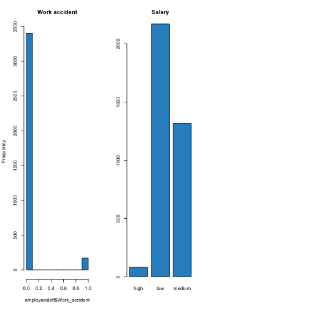
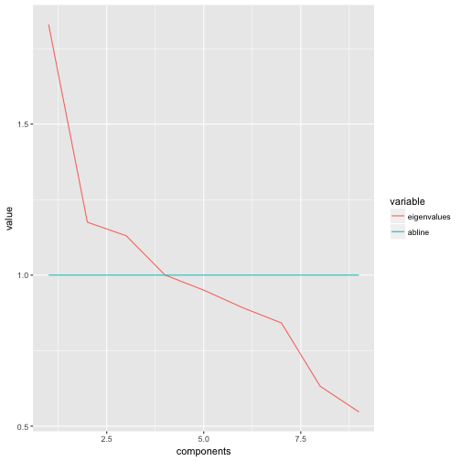
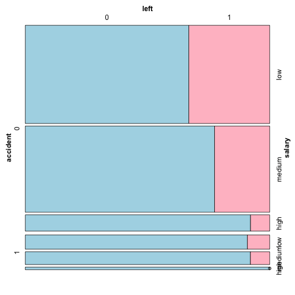

#Human Resources Analytics
##How do we retain our best and most experienced employees?

<br>Our dataset includes 14.999 observations, each line represent one single employee

<br>Fields in the dataset include the following 10 variables for each line:

<br/>-Employee satisfaction level
<br/>-Last evaluation: 
<br/>-Number of projects
<br/>-Average monthly hours
<br/>-Time spent at the company
<br/>-Whether they have had a work accident
<br/>-Whether they have had a promotion in the last 5 years
<br/>-Department
<br/>-Salary
<br/>-Whether the employee has left

###The objectives of the project are the following

<br/>1) Assess what are the relationship between the 10 variables and what are the significant variables to describe the dataset
<br/>2) Undestand who are the employees that have left
<br/>3) Focus the analysis on the most valuable employees who have left
<br/>4) Devolop a predictive model to assess the likelihood of an employee leaving 

###The project is divided in the following steps
<br>Step 1) Data quality check
<br>Step 2) Basic Data Visualisation
<br>Step 3) Principal Component Analysis
<br>Step 4) Futher comparative analysis on employees that left
<br>Step 5) Prediction Model
<br> Step 7) Conclusion

##Step 1: Data quality check:as a first step we will perform basic statistical analysis and understand the type of factors.


Looking at data we can make the following assumptions related the nature of the 10 variables:

<br/>satisfaction_level: A numeric indicator filled out by the employee ranging from 0 to 1
<br/>last_evaluation: A numeric indicator filled in by the employee’s manager ranging from 0 to 1
<br/>number_project: An integer that indicates the number of projects the employee has worked on
<br/>average_monthly_hours: The number of hours employees work in the month
<br/>time_spend_company: An integer value indicated the years of service
<br/>Work_accident: A dummy variable assessing whether(1) or not (0) they had an accident
<br/>left: A dummy variable, leave (1), not leave(0)
<br/>promoted_last_5years: A dummy variable, promoted(1), not promoted(0)
<br/>sales: A categorical variable assessing the department in which employee is working (sales,technical,support,IT, product,marketing, other)
<br/>salary: A 3-level categorical variable (low, medium, high)

###Data quality report
First of all we assess that there are no missing data with function is.na(myData) that we would not report in the code and and we perform basic summary statistic of the dataset.


```
##  satisfaction_level last_evaluation  number_project  average_montly_hours
##  Min.   :0.0900     Min.   :0.3600   Min.   :2.000   Min.   : 96.0       
##  1st Qu.:0.4400     1st Qu.:0.5600   1st Qu.:3.000   1st Qu.:156.0       
##  Median :0.6400     Median :0.7200   Median :4.000   Median :200.0       
##  Mean   :0.6128     Mean   :0.7161   Mean   :3.803   Mean   :201.1       
##  3rd Qu.:0.8200     3rd Qu.:0.8700   3rd Qu.:5.000   3rd Qu.:245.0       
##  Max.   :1.0000     Max.   :1.0000   Max.   :7.000   Max.   :310.0       
##                                                                          
##  time_spend_company Work_accident         left       
##  Min.   : 2.000     Min.   :0.0000   Min.   :0.0000  
##  1st Qu.: 3.000     1st Qu.:0.0000   1st Qu.:0.0000  
##  Median : 3.000     Median :0.0000   Median :0.0000  
##  Mean   : 3.498     Mean   :0.1446   Mean   :0.2381  
##  3rd Qu.: 4.000     3rd Qu.:0.0000   3rd Qu.:0.0000  
##  Max.   :10.000     Max.   :1.0000   Max.   :1.0000  
##                                                      
##  promotion_last_5years         sales         salary    
##  Min.   :0.00000       sales      :4140   high  :1237  
##  1st Qu.:0.00000       technical  :2720   low   :7316  
##  Median :0.00000       support    :2229   medium:6446  
##  Mean   :0.02127       IT         :1227                
##  3rd Qu.:0.00000       product_mng: 902                
##  Max.   :1.00000       marketing  : 858                
##                        (Other)    :2923
```
<br/>
<hr/>
<br/>
<br/>From basic statistical analysis we can see that the overall satisfaction of the company is really low, at around 63% and that approximately 24% of the employees have left. 

<br/>This brings us to the following step: we would like to visualize better who are the employees that have decided to leave.

##Step 2: Data Visualization

<br/>

We will start our analysis looking more deeply at a subset composed of only the employees that have left. In particular we will analyse the distribution of employees across variables:

We cut database in the desired subset composed by 3.571 observations:


```
## [1] 3571
```
<br/>We plot first of all the most intuitive variables:
<br/>"Satisfaction Level/ Last Evaluation/ Average monthly hours""


<br/>
<br/>
<br/>
<br/>

<br/>From the previous histograms we can make the following preliminar observations:

<br/>None of the distributions seems normal but we see peak at the ends of the histograms
<br> Regarding satisfaction level the distribution of employers that are leaving is quite polarized on employees that are medium on satisfaction.
<br/>Regarding employees evaluation those that leave seems either really good (>.9) or average.
<br/>Employees that leave seems to those who work a lot( >250 ) and  below average (<150)


<br/>We then look at the distribution in the categorical variables:
<br/Salary and Departments





<br/>From a first analysis of these last three histograms we can make the following observations:

<br/>  The frequency of work accident per se doesn't not mean a lot 
<br/>  Employees that left seems to have generally low salary.
<br/>  Employees that left comes mainly from sales, support and technical

From the preliminary analysis, we understand that we would like to focus our analys on employees that we consider most valuable but that are leaving.
We decide to set this criteria looking at the median value and choosing those that have worked for the company for more than 3 years, have good last evaluation results >0.72, and have performed more than 4 projects.
This group is composed by 3556 people (23,7% of employees)


```
## [1] 3556
```
<br/>
<br/>
<br/>
<br/>
<br/>
<br/>As of part of the preliminary analysis we then perform an initial correlation analysis only with numerical variables the following group of employees:
1) all the employees
2) the valuable employees identified before
3) the employees that left 


<br/>
<br/>
<br/>


<br/>
<br/>
<br/>
<br/>
<br/>


<br/>
<br/>
<br/>
###OBSERVATIONS:
<br/> As a conclusion we can see how the only singnigicant correlation that we can find are across the subgroup of the employees that have left.


##Step 3: Principal Component Analysis

<br/>We then perform a more accurate correlation by first taking the entire database, then excluding what we can consider the dependent variable (left) and finally scaling the data.


```
## [1] "satisfaction_level"    "last_evaluation"       "number_project"       
## [4] "average_montly_hours"  "time_spend_company"    "Work_accident"        
## [7] "promotion_last_5years" "sales"                 "salary"
```


```
## [1] "satisfaction_level"    "last_evaluation"       "number_project"       
## [4] "average_montly_hours"  "time_spend_company"    "Work_accident"        
## [7] "promotion_last_5years" "sales"                 "salary"
```


<br/>After having done the first  adjustments we can confirm that data are metric.
<br/>However we need to scale the data to have a more homogeneus dataset.


|                      |   min| 25 percent| median|   mean| 75 percent| max|   std|
|:---------------------|-----:|----------:|------:|------:|----------:|---:|-----:|
|satisfaction_level    |  0.09|       0.44|   0.64|   0.61|       0.82|   1|  0.25|
|last_evaluation       |  0.36|       0.56|   0.72|   0.72|       0.87|   1|  0.17|
|number_project        |  2.00|       3.00|   4.00|   3.80|       5.00|   7|  1.23|
|average_montly_hours  | 96.00|     156.00| 200.00| 201.05|     245.00| 310| 49.94|
|time_spend_company    |  2.00|       3.00|   3.00|   3.50|       4.00|  10|  1.46|
|Work_accident         |  0.00|       0.00|   0.00|   0.14|       0.00|   1|  0.35|
|promotion_last_5years |  0.00|       0.00|   0.00|   0.02|       0.00|   1|  0.14|
|sales                 |  1.00|       5.00|   8.00|   6.94|       9.00|  10|  2.75|
|salary                |  1.00|       1.00|   2.00|   1.59|       2.00|   3|  0.64|

<br/>Here reported the summary statistics of the scaled dataset:


|                      |   min| 25 percent| median| mean| 75 percent|  max| std|
|:---------------------|-----:|----------:|------:|----:|----------:|----:|---:|
|satisfaction_level    | -2.10|      -0.70|   0.11|    0|       0.83| 1.56|   1|
|last_evaluation       | -2.08|      -0.91|   0.02|    0|       0.90| 1.66|   1|
|number_project        | -1.46|      -0.65|   0.16|    0|       0.97| 2.59|   1|
|average_montly_hours  | -2.10|      -0.90|  -0.02|    0|       0.88| 2.18|   1|
|time_spend_company    | -1.03|      -0.34|  -0.34|    0|       0.34| 4.45|   1|
|Work_accident         | -0.41|      -0.41|  -0.41|    0|      -0.41| 2.43|   1|
|promotion_last_5years | -0.15|      -0.15|  -0.15|    0|      -0.15| 6.78|   1|
|sales                 | -2.16|      -0.70|   0.39|    0|       0.75| 1.12|   1|
|salary                | -0.93|      -0.93|   0.64|    0|       0.64| 2.21|   1|


<br> We can now once again perform correlation on those data and as we can see there are few variable showing strong pariwise corrrelation (+0.3)

```r
thecor = round(cor(ProjectDatafactor_scaled),2)
colnames(thecor)<-colnames(ProjectDatafactor_scaled)
rownames(thecor)<-colnames(ProjectDatafactor_scaled)

knitr::kable(round(thecor,2))
```


|                      | satisfaction_level| last_evaluation| number_project| average_montly_hours| time_spend_company| Work_accident| promotion_last_5years| sales| salary|
|:---------------------|------------------:|---------------:|--------------:|--------------------:|------------------:|-------------:|---------------------:|-----:|------:|
|satisfaction_level    |               1.00|            0.11|          -0.14|                -0.02|              -0.10|          0.06|                  0.03|  0.01|   0.05|
|last_evaluation       |               0.11|            1.00|           0.35|                 0.34|               0.13|         -0.01|                 -0.01|  0.01|  -0.01|
|number_project        |              -0.14|            0.35|           1.00|                 0.42|               0.20|          0.00|                 -0.01|  0.02|   0.00|
|average_montly_hours  |              -0.02|            0.34|           0.42|                 1.00|               0.13|         -0.01|                  0.00|  0.01|   0.00|
|time_spend_company    |              -0.10|            0.13|           0.20|                 0.13|               1.00|          0.00|                  0.07| -0.03|   0.05|
|Work_accident         |               0.06|           -0.01|           0.00|                -0.01|               0.00|          1.00|                  0.04|  0.01|   0.01|
|promotion_last_5years |               0.03|           -0.01|          -0.01|                 0.00|               0.07|          0.04|                  1.00| -0.04|   0.10|
|sales                 |               0.01|            0.01|           0.02|                 0.01|              -0.03|          0.01|                 -0.04|  1.00|  -0.06|
|salary                |               0.05|           -0.01|           0.00|                 0.00|               0.05|          0.01|                  0.10| -0.06|   1.00|

<br>Despite that, we would proceed with PCA ans after trying differerent combination of PCA ( manual, varimax , eigenvalue) we assess that best model is given by "eingenvalue".


|            | Eigenvalue| Pct of explained variance| Cumulative pct of explained variance|
|:-----------|----------:|-------------------------:|------------------------------------:|
|Component 1 |       1.83|                     20.33|                                20.33|
|Component 2 |       1.18|                     13.06|                                33.39|
|Component 3 |       1.13|                     12.56|                                45.95|
|Component 4 |       1.00|                     11.12|                                57.07|
|Component 5 |       0.95|                     10.56|                                67.63|
|Component 6 |       0.89|                      9.92|                                77.54|
|Component 7 |       0.84|                      9.35|                                86.90|
|Component 8 |       0.63|                      7.02|                                93.92|
|Component 9 |       0.55|                      6.08|                               100.00|



|                      | Component 1| Component 2| Component 3| Component 4|
|:---------------------|-----------:|-----------:|-----------:|-----------:|
|last_evaluation       |        0.76|        0.01|        0.21|       -0.01|
|average_montly_hours  |        0.76|       -0.02|       -0.05|       -0.01|
|number_project        |        0.74|       -0.03|       -0.30|        0.02|
|time_spend_company    |        0.30|        0.31|       -0.50|        0.07|
|satisfaction_level    |        0.08|        0.16|        0.86|        0.10|
|sales                 |        0.03|       -0.45|        0.01|        0.51|
|salary                |        0.00|        0.66|        0.10|       -0.12|
|Work_accident         |       -0.02|        0.15|        0.05|        0.81|
|promotion_last_5years |       -0.04|        0.63|       -0.10|        0.26|


|                      | Component 1| Component 2| Component 3| Component 4|
|:---------------------|-----------:|-----------:|-----------:|-----------:|
|last_evaluation       |        0.76|          NA|          NA|          NA|
|average_montly_hours  |        0.76|          NA|          NA|          NA|
|number_project        |        0.74|          NA|          NA|          NA|
|time_spend_company    |          NA|          NA|       -0.50|          NA|
|satisfaction_level    |          NA|          NA|        0.86|          NA|
|sales                 |          NA|          NA|          NA|        0.51|
|salary                |          NA|        0.66|          NA|          NA|
|Work_accident         |          NA|          NA|          NA|        0.81|
|promotion_last_5years |          NA|        0.63|          NA|          NA|

<br>Based on eingvalue we can see that database can be reduced to three principal components that we try to interpret:

<br>Component 1 (number of project, monthly hours, last evaluation):  we will call this component "commitment"
<br>Component 2 : (salary, promotion) we can call this component "compensation"
<br>Component 3: (time spent at company, satisfaction) we can call this component "work-life balance"
<br>Component 4:  (department, work accident) we can call this component "role"

###OBSERVATIONS:
<br>PCA seems to be logically consistent in lowering the number of component to 4. We can infer that number of project, monthly hours, last evaluation ( commitment) is group most interrelated variables.
However given the limited number independent variables that we have in the dataset and the limited correlation across those variables we can conclude that PCA is not particularly useful in our case.

##Step 4) Futher comparative analysis on employees that left

<br>We than look more closely to employees that left but in this case we directly compare them to those who haven't left


| vars|     n|  mean|   sd| median| trimmed|  mad|  min| max| range| skew| kurtosis|  se|
|----:|-----:|-----:|----:|------:|-------:|----:|----:|---:|-----:|----:|--------:|---:|
|    1| 11428|   0.7|  0.2|    0.7|     0.7|  0.2|  0.1|   1|   0.9| -0.6|     -0.2| 0.0|
|    2| 11428|   0.7|  0.2|    0.7|     0.7|  0.2|  0.4|   1|   0.6|  0.0|     -1.0| 0.0|
|    3| 11428|   3.8|  1.0|    4.0|     3.8|  1.5|  2.0|   6|   4.0|  0.3|     -0.4| 0.0|
|    4| 11428| 199.1| 45.7|  198.0|   199.5| 56.3| 96.0| 287| 191.0| -0.1|     -1.0| 0.4|
|    5| 11428|   3.4|  1.6|    3.0|     3.1|  1.5|  2.0|  10|   8.0|  2.1|      5.2| 0.0|
|    6| 11428|   0.2|  0.4|    0.0|     0.1|  0.0|  0.0|   1|   1.0|  1.7|      0.9| 0.0|
|    7| 11428|   0.0|  0.0|    0.0|     0.0|  0.0|  0.0|   0|   0.0|  NaN|      NaN| 0.0|
|    8| 11428|   0.0|  0.2|    0.0|     0.0|  0.0|  0.0|   1|   1.0|  5.9|     33.1| 0.0|
|    9| 11428|   6.9|  2.7|    8.0|     7.2|  3.0|  1.0|  10|   9.0| -0.8|     -0.6| 0.0|
|   10| 11428|   1.7|  0.7|    2.0|     1.6|  1.5|  1.0|   3|   2.0|  0.5|     -0.7| 0.0|


| vars|    n|  mean|   sd| median| trimmed|  mad|   min|   max| range| skew| kurtosis| se|
|----:|----:|-----:|----:|------:|-------:|----:|-----:|-----:|-----:|----:|--------:|--:|
|    1| 3571|   0.4|  0.3|    0.4|     0.4|  0.4|   0.1|   0.9|   0.8|  0.3|     -1.0|  0|
|    2| 3571|   0.7|  0.2|    0.8|     0.7|  0.3|   0.4|   1.0|   0.6|  0.0|     -1.7|  0|
|    3| 3571|   3.9|  1.8|    4.0|     3.7|  3.0|   2.0|   7.0|   5.0|  0.2|     -1.5|  0|
|    4| 3571| 207.4| 61.2|  224.0|   205.7| 97.9| 126.0| 310.0| 184.0|  0.1|     -1.6|  1|
|    5| 3571|   3.9|  1.0|    4.0|     3.8|  1.5|   2.0|   6.0|   4.0|  0.5|     -0.8|  0|
|    6| 3571|   0.0|  0.2|    0.0|     0.0|  0.0|   0.0|   1.0|   1.0|  4.3|     16.2|  0|
|    7| 3571|   1.0|  0.0|    1.0|     1.0|  0.0|   1.0|   1.0|   0.0|  NaN|      NaN|  0|
|    8| 3571|   0.0|  0.1|    0.0|     0.0|  0.0|   0.0|   1.0|   1.0| 13.6|    182.8|  0|
|    9| 3571|   7.0|  2.8|    8.0|     7.3|  3.0|   1.0|  10.0|   9.0| -0.8|     -0.6|  0|
|   10| 3571|   1.4|  0.5|    1.0|     1.4|  0.0|   1.0|   3.0|   2.0|  0.8|     -0.5|  0|

Here we can have a overview of the data; for example, there are 3571 observations in `1` group, values of mean and median of `satisfaction` in `1` group is smaller than `0` group's. The correlation plot show some relationships of first 8 variables. Obviously, with lower satisfaction level, employees will have stronger desire to leave. If someone can deal with more projects and spend more time on work, he or she will obtain higher evaluation.

###Plot the two subset one against the other

we may find the evidence who will leave next.


Wile the table plot can show us enough features, We should do some more plots to analyse further


```
## `stat_bin()` using `bins = 30`. Pick better value with `binwidth`.
## `stat_bin()` using `bins = 30`. Pick better value with `binwidth`.
## `stat_bin()` using `bins = 30`. Pick better value with `binwidth`.
```


People with too few or too many hours per month on work tend to quit. The former may have little challenge in work and just get bored. On the contrary, the latter dont't want to spend much time on work. Employees who left get lower or higher last evaluation. Sense of satisfaction seems to be another factor; Satisfation level of 71.32 % employees who left is less than 0.5.


In the former correlation plot, there is a kind of positive correlativity between `project` and `hours`, so the two variables maybe share the similar impact. People with few projets( less than 3) and too many projects( more than 5) tend to leave. In the left group, number of employees with three-year experience is 1586, almost half of the group. But, more than 50% employees with five-year experience quited, which is big loss for a company.



Interestingly, employees with stronger desire to leave tend to have no accident in their work. Low salary also contributes to  resigning. Given variable `promotion`, the value's distribution is so uneven; we can see, only 319 out of 14999 employees have gotten promotion in the last five years. I will just eliminate the variable `promotion` in prediction process.

### Reasons of Employees Leaving?

Here are some reasons I've gotten from above analysis:

- Lower satisfication level is significant;

- Few or too many projects, little or too much time on work;

- Low salary;

- Three-to-six year for company is the risk time;

- Few chances to get promotion( I just guess).

### Who Are Valuable Employees And Why Do They Leave?

In my view, the employees with evaluation `>=0.72`, equal or more than 3-year-experience in the company and equal or more than  4 projects in hand can be considered to be experienced and valuable ones for a company. More than half of the experienced ones left. It seems that they suffer from:

- low level of satisfaction

- too much work

- no promotion

- low salary


```
## 
##         0         1 
## 0.5821759 0.4178241
```


We can find some employees with high sense of satisfaction also left in the box plot. The table plot shows they sustain the same problems with other left ones. Maybe there are still some reasons out of the dataset.


##Step 5: Prediction Model

It's time for us to model. We may get a good one to predict who will leave next.We will split the dataset into two parts, `train` and `test`. A classification tree will be built firstly, then forest.


```
## CART 
## 
## 10000 samples
##     8 predictor
##     2 classes: '0', '1' 
## 
## No pre-processing
## Resampling: Cross-Validated (5 fold, repeated 3 times) 
## Summary of sample sizes: 8001, 8000, 8000, 7999, 8000, 8001, ... 
## Resampling results across tuning parameters:
## 
##   cp    Accuracy   Kappa    
##   0.01  0.9704340  0.9168482
##   0.02  0.9650673  0.9026535
##   0.03  0.9619342  0.8945309
## 
## Accuracy was used to select the optimal model using  the largest value.
## The final value used for the model was cp = 0.01.
```


A single tree can get a score like 0.970434, which is so unbelievable. The original dataset is so friendly. Some variables are more important in prediction as we can see from tree plot, such as, `satisfication`, `years`, `evaluation` and `hours`. Now we model a random forest.


```
## Confusion Matrix and Statistics
## 
##           Reference
## Prediction    0    1
##          0 3781   29
##          1   15 1174
##                                           
##                Accuracy : 0.9912          
##                  95% CI : (0.9882, 0.9936)
##     No Information Rate : 0.7594          
##     P-Value [Acc > NIR] : < 2e-16         
##                                           
##                   Kappa : 0.9758          
##  Mcnemar's Test P-Value : 0.05002         
##                                           
##             Sensitivity : 0.9960          
##             Specificity : 0.9759          
##          Pos Pred Value : 0.9924          
##          Neg Pred Value : 0.9874          
##              Prevalence : 0.7594          
##          Detection Rate : 0.7564          
##    Detection Prevalence : 0.7622          
##       Balanced Accuracy : 0.9860          
##                                           
##        'Positive' Class : 0               
## 
```
##Step 7: Conclusion

So, `rf_mdl` works better, and which variable is the most important? From importance of variables, we can infer reasons that employees left, especially experienced and valuable ones.


In our opinion Improving level of satisfaction is the key to keep employees remain. While, reasonable workload and working time, promotion and appropriate salary increasing can be useful measures to achieve the key. There is no doubt a valuable employee is important to a company, whether he or she is an experienced or potential one.


Our conclusion is 

